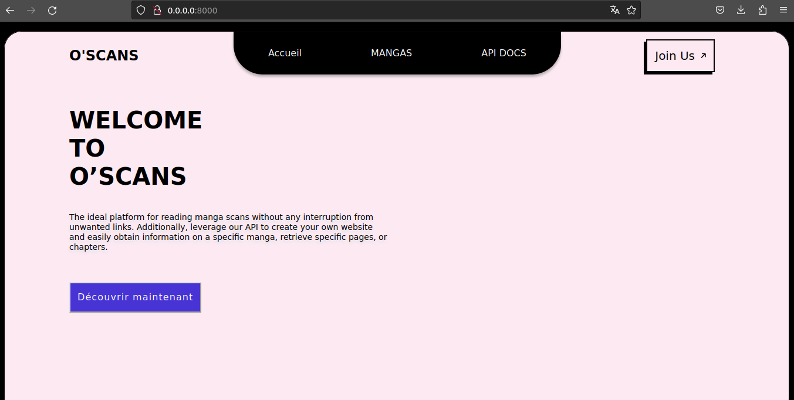
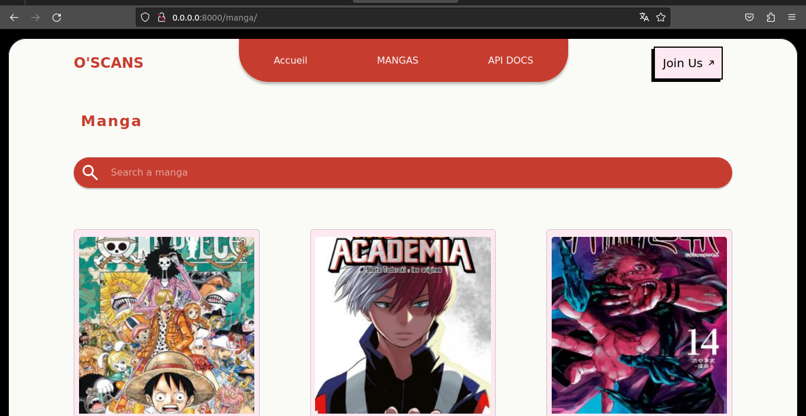
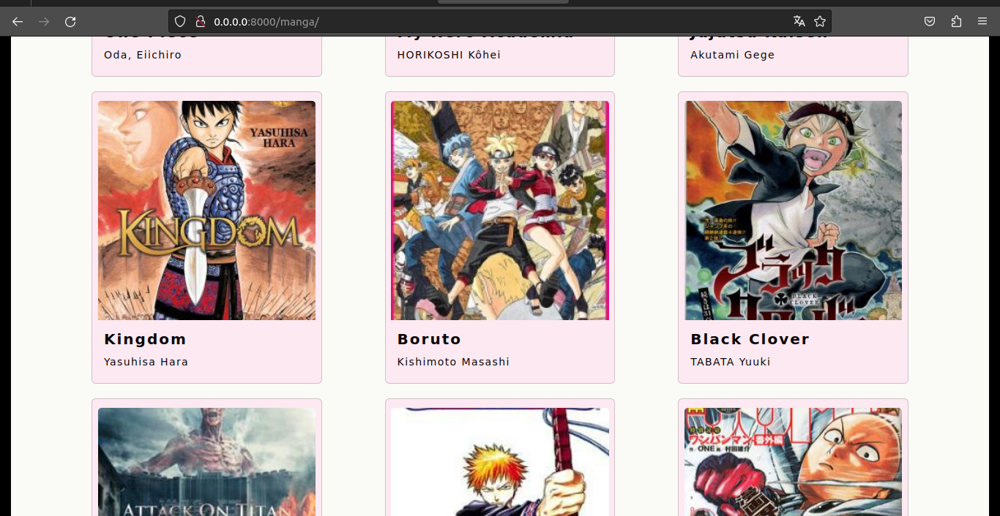
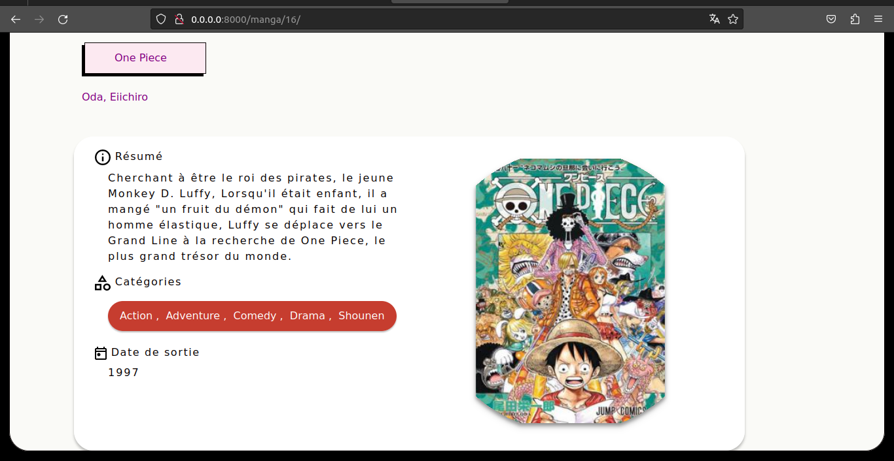
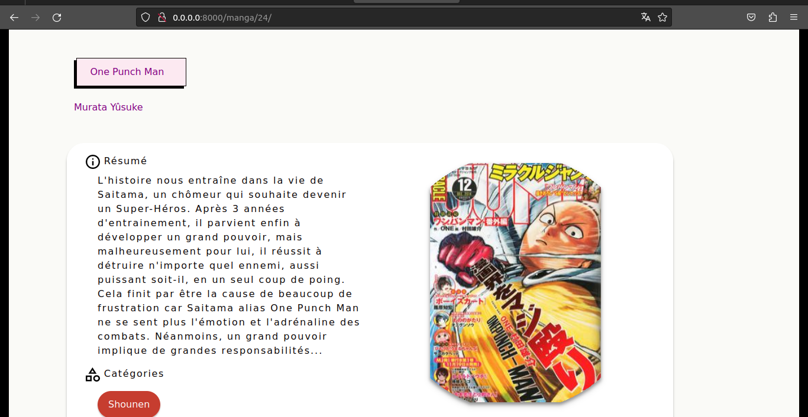
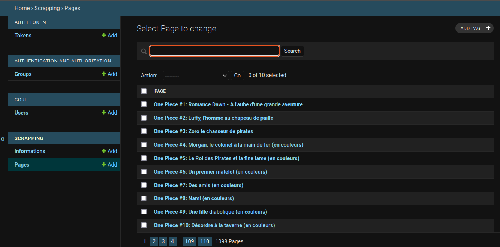
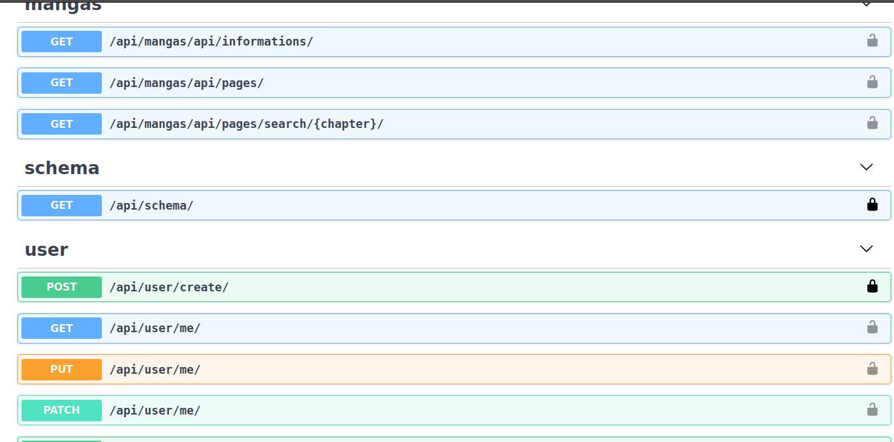
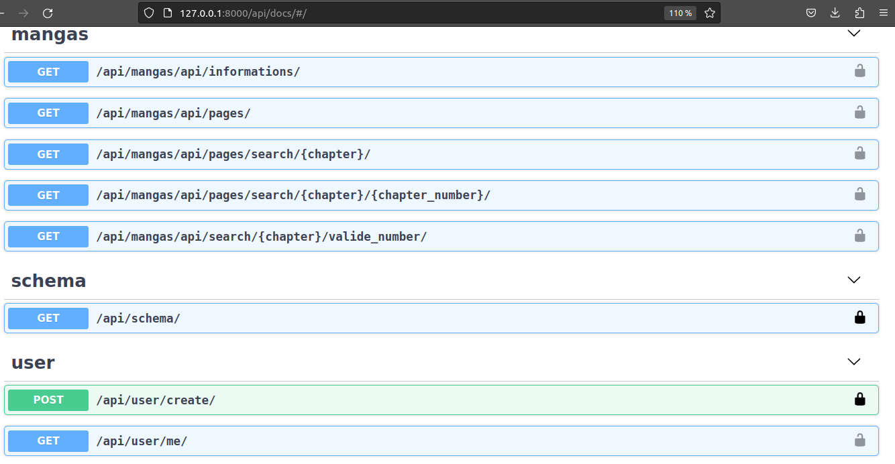

# manga-app-api

### Templates integration
##### acceuil

##### manga avec les vrais données

 

### Admin Interface

### API

### UPDATE

### A faire prochainnement : Gerer la partie recherche des mangas 